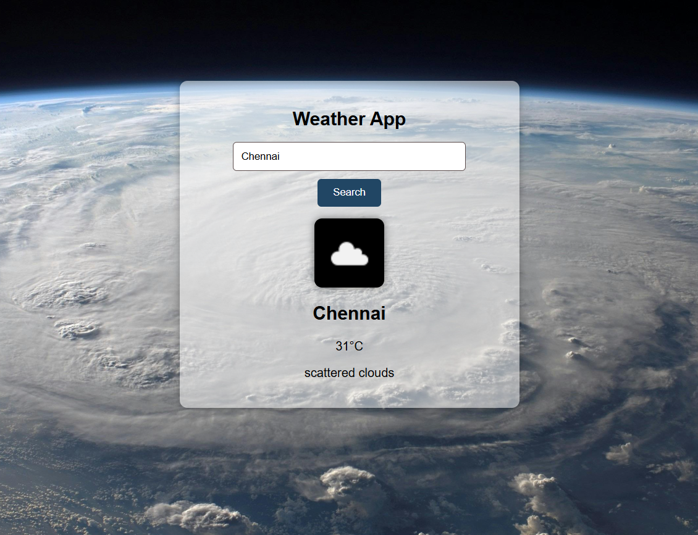

# 🌦️ Weather App

A simple weather application built using **HTML, CSS, and JavaScript** that fetches real-time weather data using the OpenWeatherMap.

---

## 🚀 Features

- 🔍 Search weather by city name
- 🌡️ Displays temperature in °C
- 🌥️ Shows weather condition & description
- 💧 Displays humidity and wind speed
- 🖼️ Weather icon display
- 🎨 Styled UI with background image

---

## 🛠️ Technologies Used

- HTML
- CSS
- JavaScript (Fetch API)
- OpenWeatherMap API

---

## 📂 Project Structure

```
project/
│
├── index.html
├── style.css
├── script.js
└── bg.jpg
```

---

## ⚙️ How to Run

1. Clone or download the project
2. Open `index.html` in your browser
3. Enter a city name and click **Search**

---

## 🔑 API Setup

1. Sign up at https://openweathermap.org
2. Generate an API key
3. Replace in `script.js`:

```js
const apikey = "YOUR_API_KEY";
```

---

## Preview


Displays:

- City name
- Temperature
- Weather description
- Weather icon

---

## 💡 Future Improvements

- 📍 Current location weather
- 📅 5-day forecast
- 🌗 Dynamic background based on weather
- 💾 Save last searched city

---

## 📌 Note

- API key may take a few minutes to activate
- Make sure city names are entered correctly

---

## 👩 Author

Your Name
